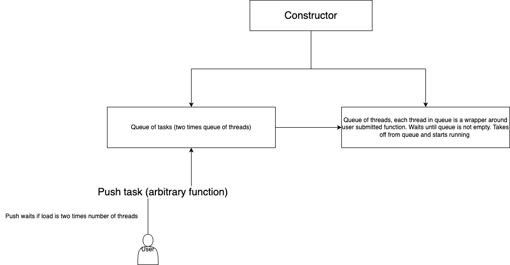

# HIVE, a Simple Thread Pool Library

## Usage
Example:
```
#include <iostream>
#include <pthread.h>
#include <unistd.h>
#include <string>

#include "ThreadPool.hpp"

using std::cout, std::endl;

pthread_mutex_t mutex = PTHREAD_MUTEX_INITIALIZER;

void func(std::string url) {
    pthread_mutex_lock(&mutex);
    cout << "Working on " << url << endl;
    pthread_mutex_unlock(&mutex);

    // Some work
    sleep(3);

    pthread_mutex_lock(&mutex);
    cout << "Finished " << url << endl;
    pthread_mutex_unlock(&mutex);
}

int main() {
    ThreadPool pool = ThreadPool(5);

    for (int i = 0; i < 20; ++i) {
        std::string url = "google.com/" + std::to_string(i);
        pool.queue(Task(func, url));
    }

    pool.wait();
}
```

The ThreadPool API exposes two methods, `queue` and `wait`. `queue` allows you to queue a `Task` that will eventually get picked up by a worker thread in the pool. `wait` allows you to wait until all tasks in the queue are executed. 

You can queue a task using the `Task` struct defined as
```
typedef struct Task {
    std::function<void()> func;

    Task() = delete;

    template<typename F, typename... Args>
    Task(F&& f, Args&&... args) {
        func = [f = std::forward<F>(f), tup = std::make_tuple(std::forward<Args>(args)...)]() mutable {
            std::apply(f, tup);
        };
    }

} Task;
```
You can assign arbitrary functions to `func` and as many arguments you want to.

## Architecture
The internals are very simple, there is a queue of tasks submitted by users and a vector of threads that run until the thread pool is destructed. The "worker" threads take tasks off of the task queue and run it.


## TODO
- Implement getting the return value from a function. Things to look into: `std::future` and `std::promise`.
- Testing. Currently no tests in the tests folder. Could use more unit tests and end to end tests.